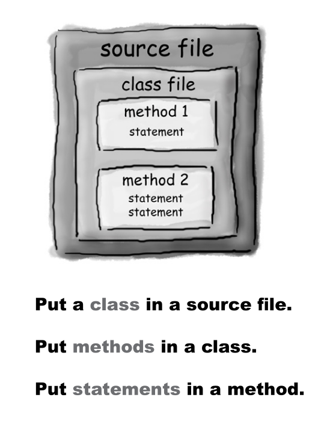
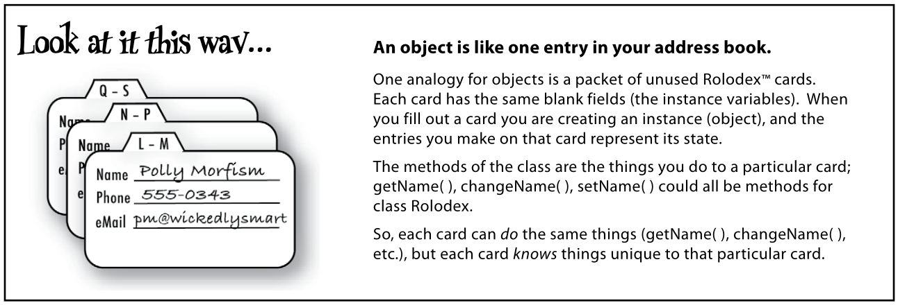

# Head First Java

```
source -> compiler -> output
```
`javac` converts the code to bytecode
<br>
`java` runs the bytecode in java virtual machine



### Class

It's a blueprint of an object, its says how an object should look like. Each object made from the class can have its own value for instance variables

